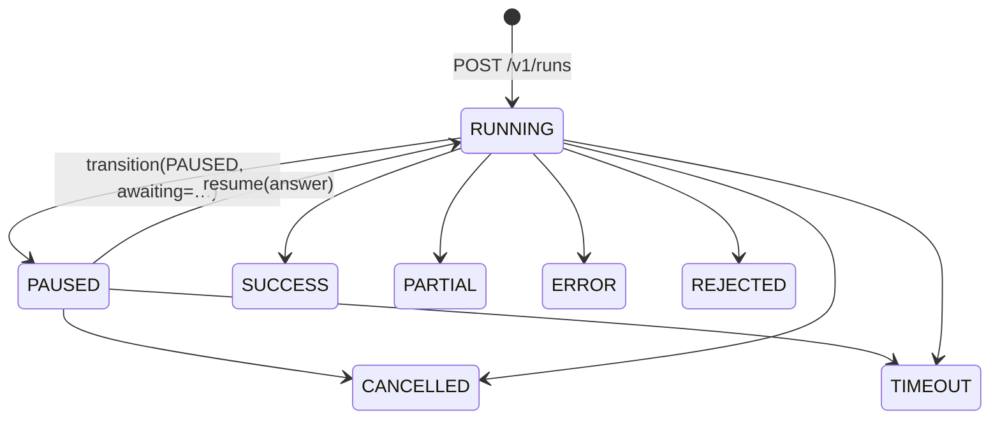
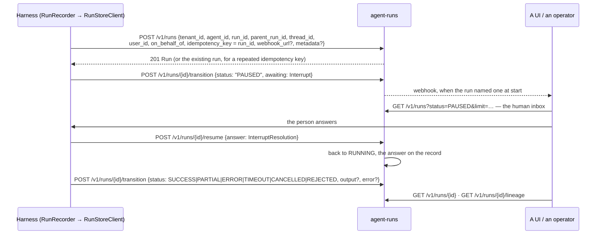

# agent-runs

Durable agent runs: start, pause for a human, resume, cancel, replay.

A run is the unit of work a user can leave and come back to. The harness executes; this
service remembers — so a run that pauses for an approval at 2am is still there at 9am, and a
crashed worker does not lose the answer a human already gave.

## The state machine

The states are the contract's own `trellis.contracts.AgentStatus`, not a private vocabulary — a run
the harness calls PAUSED and this service called SUSPENDED would be two names for one fact, and they
would drift. `RUNNING` is the one state this service adds, because the contract describes how a turn
*ended*, and a turn in flight has not ended.



`PAUSED` is the interesting state: it carries the question that was asked and the schema of the
answer expected, so a UI can render an approval without knowing anything about the agent that
raised it. A paused run cannot jump straight to a success — something has to actually run to produce
a result — and any transition not drawn above is a `409`, which is what keeps "why did this run
finish twice?" answerable.

## The wire the harness uses

`trellis-harness`'s `RunStoreClient` — the contracts `RunStore` port — speaks exactly these routes.
Every call carries `X-Api-Key` and `X-Tenant-Id`; the credential decides the tenant, and a header
naming a different one is a `403`, not a read.



| Route | Used for | Worth knowing |
|---|---|---|
| `POST /v1/runs` | open a run | the harness sends its derived `run_id` as the `idempotency_key`, so a retried turn reopens nothing |
| `POST /v1/runs/{id}/transition` | every state change, the pause included | `awaiting` carries the contracts `Interrupt`; an illegal or repeated transition is `409`, which the harness treats as *the record protecting itself*, not as a failure |
| `POST /v1/runs/{id}/resume` | a human's reply | the answer is in the **body** (`{"answer": …}`), never a query parameter — an answer can be an object, and a `200` that silently dropped it is the bug this shape fixes |
| `GET /v1/runs/{id}` | one record | |
| `GET /v1/runs?status=PAUSED` | the inbox of runs waiting on a person | also filters on `agent_id`, `thread_id`, `parent_run_id`; `limit` 1–500 |
| `GET /v1/runs/{id}/lineage` | the run and its ancestors, nearest first | how a nested agent run is traced back to the turn that started it |

Recording is **best-effort on the harness side**: this service is a system of record, not a
dependency of the turn, so a failed write is logged and the turn continues (`required=True` inverts
that where an unrecorded run is worse than a failed one). Ordering is *not* best-effort — the
harness drains its record queue in order, so `started` never arrives after `finished`.

A deployment that runs Temporal instead puts its runs there behind the same port
(`pip install "trellis-harness[temporal]"`, `runs.engine: temporal`); nothing in an agent changes.

## Guarantees

- **Idempotent starts.** A start is keyed per tenant; replaying the same key returns the
  existing run rather than creating a second one.
- **One writer at a time.** State transitions take `SELECT … FOR UPDATE` on the run row, so
  two workers racing to finish the same run cannot interleave.
- **Tenant-bound credentials.** An API key is bound to the tenant it was issued for;
  presenting a valid key for someone else's tenant is a 403, not a read.

## Run it

```bash
uv sync
uv run uvicorn agent_runs.api.app:app --port 8095
```

## Tests

```bash
uv run pytest
```
