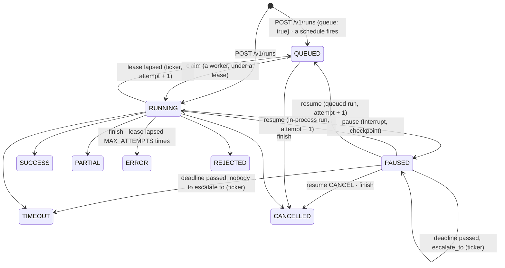

# agent-runs

Durable agent runs, the worker queue, the human inbox, and the schedules that start runs.
One service (it absorbed agent-schedules in 0.2.0): an API process and a ticker process over
one PostgreSQL database.

This service never executes an agent. A harness does, either in its own process (it records
the run here as `RUNNING`) or as a `trellis worker` that claims `QUEUED` runs from here under
a lease. This service remembers: a run that pauses for an approval at 2 a.m. is still there
at 9 a.m., a crashed worker's run goes back on the queue, and a schedule fires on behalf of a
person who is not present.

Every record is a [trellis-contracts](../agent-contracts) type: a run is a `RunRecord`
started from a `RunStart`, paused with an `Interrupt`, resumed with an
`InterruptResolution`; a schedule is a `Schedule` created from a `ScheduleSpec`.

## The state machine

The contracts' `RunStatus.can_become` is the only transition check; anything else is a
`409`.



## The API

All routes need `X-Api-Key`. [docs/api.md](docs/api.md) has every route, body and status
code, and the exact claim, heartbeat and resume semantics a worker implements.

| Route | What it does |
|---|---|
| `POST /v1/runs` | record a run (`RUNNING`), or queue it (`queue: true` → `QUEUED`); idempotent on run id and `idempotency_key` |
| `POST /v1/runs/claim` | lease the oldest queued run of `agent_ids` to `worker_id`, or `204` |
| `POST /v1/runs/{id}/heartbeat` | extend the lease; `409` = lease lost, stop |
| `POST /v1/runs/{id}/pause` | the run waits on an `Interrupt` (assignee, deadline, escalation), keeping the executor's opaque `checkpoint` for whoever resumes it |
| `POST /v1/runs/{id}/resume` | answer it with an `InterruptResolution` |
| `POST /v1/runs/{id}/finish` | end it: `SUCCESS`, `PARTIAL`, `ERROR`, `TIMEOUT`, `CANCELLED`, `REJECTED` |
| `GET /v1/runs/{id}` | one run, the full record |
| `GET /v1/runs?status=PAUSED&assignee=…` | run summaries; with these filters, the inbox of a person or role |
| `POST /v1/schedules` | create a schedule, or get the one with the same agent, `on_behalf_of`, cadence and input (an upsert) |
| `GET /v1/schedules` · `GET/PATCH/DELETE /v1/schedules/{id}` | list, read, change (`{"enabled": false}` pauses, `true` resumes), delete |
| `POST /v1/schedules/{id}/fire` | fire now |
| `POST/GET /v1/webhooks` · `DELETE /v1/webhooks/{id}` | the tenant's webhook subscriptions |

## The ticker

`agent-runs-ticker` is one loop (every `TICK_SECONDS`), straight against the database:

1. **Schedules.** Each due schedule is claimed with `FOR UPDATE SKIP LOCKED` and fired: its
   run is inserted `QUEUED` in the same transaction, idempotent on `(schedule_id,
   fire_time)`. A run that cannot be queued is recorded on the schedule, which backs off
   (retryable) or pauses itself (permanent, or `MAX_CONSECUTIVE_FAILURES`).
2. **Leases.** A `RUNNING` run whose lease lapsed goes back to `QUEUED` as the next attempt,
   or ends in `ERROR` after `MAX_ATTEMPTS`.
3. **Escalation.** A `PAUSED` run past its interrupt's `deadline` moves to `escalate_to`
   (once) or ends in `TIMEOUT`, with a webhook event either way.
4. **Webhooks.** Due deliveries in the outbox are sent (one attempt each, concurrently),
   then removed, or rescheduled with backoff.

Each step is bounded per tick and safe in several replicas. A tick that fails as a whole
(the database is down) counts against a breaker; `python -m agent_runs.heartbeat` is the liveness
check (a heartbeat file touched after every tick, `RUNS__TICKER__HEARTBEAT_FILE`, one per
ticker; unset, each ticker process beats into its own file in the temp directory).

## Authentication

One scheme, one key system. `X-Api-Key` is a key issued by the Memory Service; agent-runs
introspects it there (`GET {RUNS__MEMORY__URL}/v1/keys/self`, cached 60 s, refusals 10 s)
and learns the tenant it speaks for, the principal recorded as `created_by`, and the
principals it may put in `on_behalf_of`. The contract is in
[docs/api.md](docs/api.md#authentication). A platform key has no tenant of its own and names the tenant it acts
for in `X-Trellis-Tenant`; a tenant key may send that header only to agree with itself
(`403` otherwise).

## Webhooks

A tenant subscribes URLs to run events (`POST /v1/webhooks`: `run.paused`,
`run.escalated`, `run.finished`); each subscription has its own secret, shown once. An event
is written to an outbox in the transaction of the run change that caused it and the ticker
sends it, retried with the service's backoff, at least once. The envelope and the signature
are the Memory Service's: `X-Trellis-Signature: t=<unix seconds>,v1=<hex hmac-sha256 of
"<t>.<body>">`, with `X-Trellis-Event` and `X-Trellis-Delivery`, so one receiver verifies
both with `trellis.memory.webhooks.verify_signature`; `event_id` is stable per event, so a
receiver drops repeats.

## Run it

Needs PostgreSQL, the Memory Service (the key registry, `RUNS__MEMORY__URL`) and a checkout
of `agent-contracts` next to this one (a path dependency).

```bash
make install                 # uv sync, trellis-contracts from ../agent-contracts
make migrate                 # alembic upgrade head (RUNS__DATABASE__URL)
uv run agent-runs            # the API on RUNS__SERVICE__PORT
uv run agent-runs-ticker     # the ticker
make up                      # or all of it in docker compose: postgres, migrate, api, ticker
```

Configuration is `RUNS__*` environment variables, each documented in
[.env.example](.env.example); every other number is a named constant in
`src/agent_runs/config/constants.py`.

## Develop

```bash
make lint typecheck test
```

The suite runs against the local PostgreSQL in its own database (`agent_runs_tests`, dropped
and recreated per run) and skips with a reason when there is none. The key registry is a
fake (`tests/conftest.py`, `FakeMemory`, a tiny ASGI app answering `/v1/keys/self`). Migrations live in
`alembic/versions`; a test checks they build exactly the schema the code maps.
