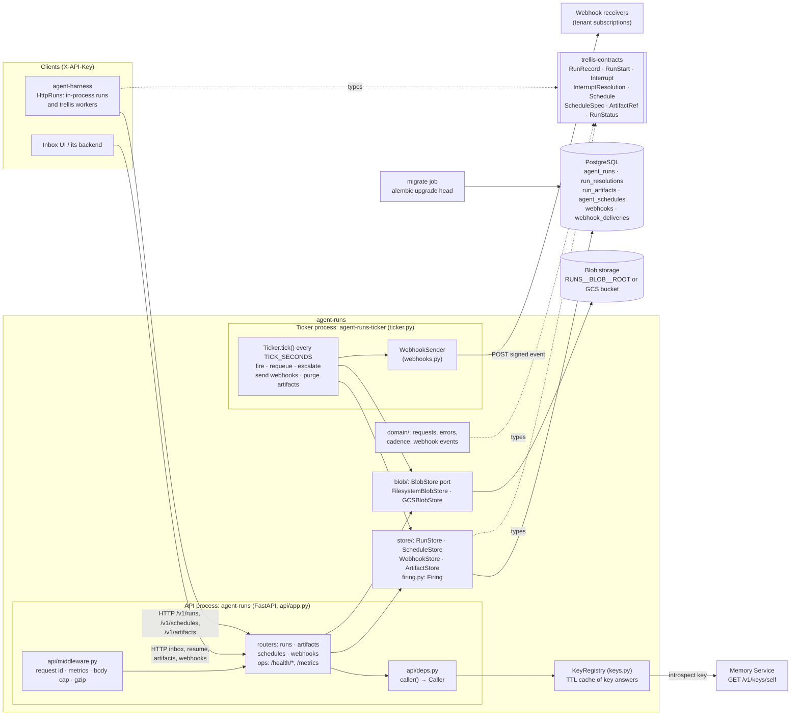
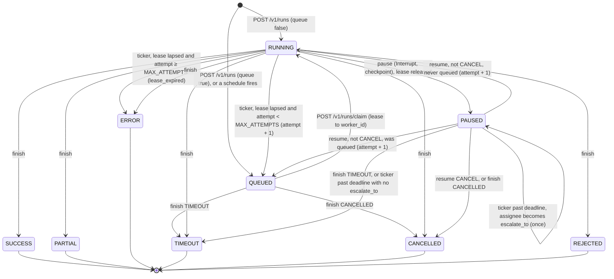
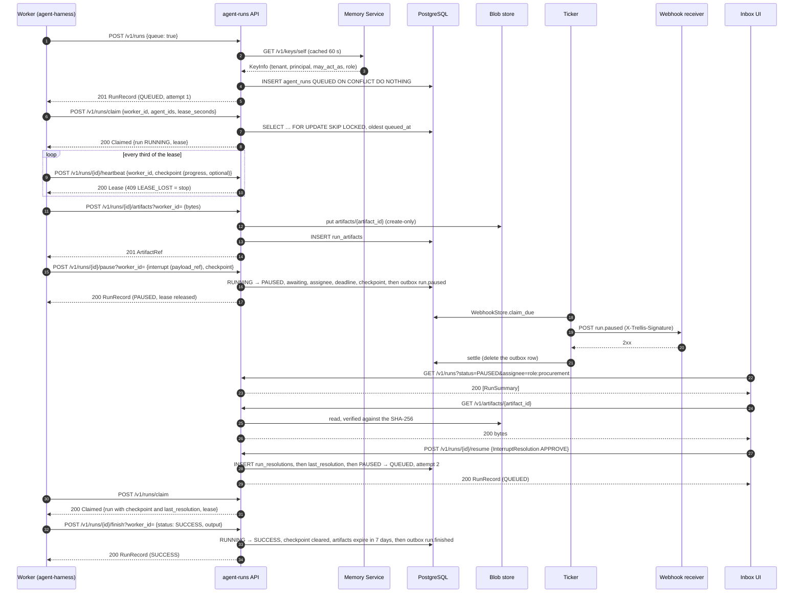
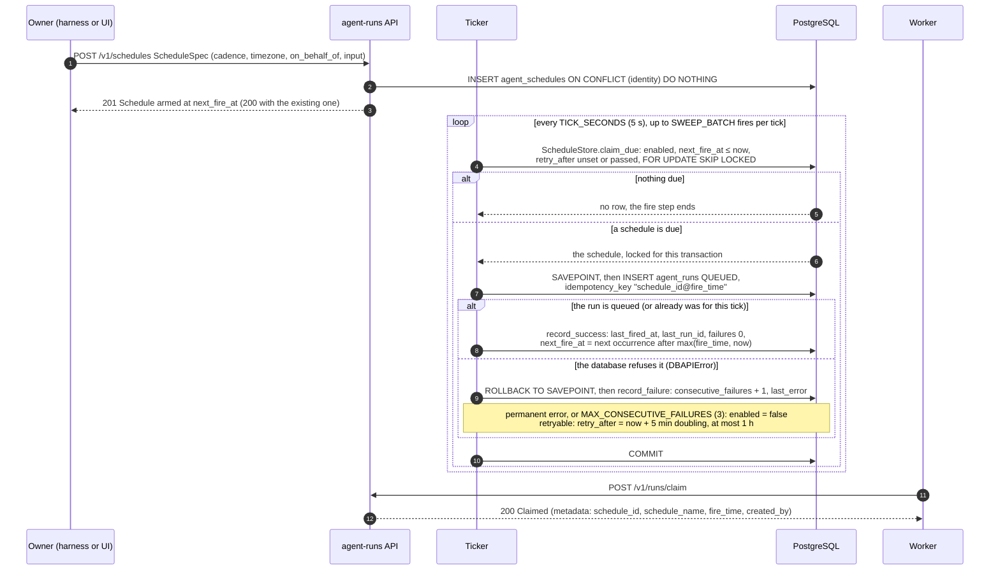
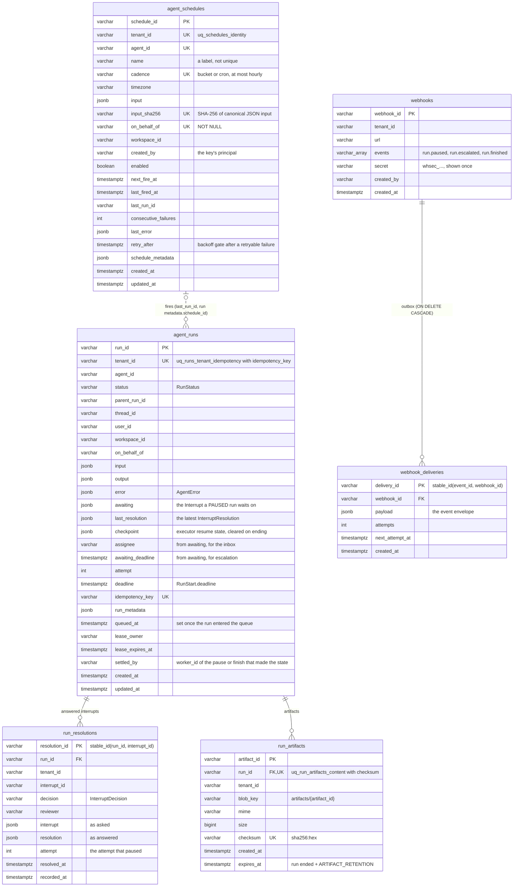

# agent-runs architecture

How the service is put together, drawn from the code: every name below is a module, class,
method, route, column or constant in this repository (or in `trellis-contracts`, where
marked). The wire contract is [api.md](api.md); this page is the inside.

- [Components](#components)
- [The run lifecycle](#the-run-lifecycle)
- [Start, interrupt, resume](#start-interrupt-resume)
- [A scheduled run firing](#a-scheduled-run-firing)
- [The tables](#the-tables)
- [Code map](#code-map)

## Components

Two processes from one image share one PostgreSQL database and one blob store. Neither
executes an agent: the harness does, and records here what happened.



| Component | Where | What it owns |
|---|---|---|
| API | `api/app.py` `create_app`, `api/routers/*` | the HTTP surface |
| OpenAPI | `api/openapi.py` `custom_openapi`, `api/examples.py`, `tools/export_openapi.py` | the document every route shares (metadata, `<tag>.<function>` ids, the `ApiKeyAuth` scheme, a problem on every error status, standard headers); `docs/openapi.json` is it committed, and `tests/test_openapi.py` fails when they differ |
| Errors | `api/errors.py` `install_error_handlers`, `Problem`; `domain/errors.py` `ErrorCode` | every failure as an RFC 9457 problem: `ServiceError` subclasses with their status and `code`, FastAPI's validation and HTTP errors, a database that went away (`503`, `Retry-After`), anything else (`500`, no internals) |
| Middleware | `api/middleware.py` `RequestContextMiddleware`, `BodyLimitMiddleware`, `CompressionMiddleware` | `X-Request-ID` in, out and in every problem; request metrics by route template; the JSON body cap counted as bytes arrive; gzip, except artifact bytes |
| Rate limit | `api/ratelimit.py` `TenantRateLimiter`, `api/deps.py` `_within_budget` | a token bucket per tenant per worker process; `429` with `Retry-After`, `X-RateLimit-*` on every counted response |
| Metrics | `observability/metrics.py` | one Prometheus registry per process: the API's `/metrics`, the ticker's `RUNS__TICKER__METRICS_PORT` |
| Caller resolution | `api/deps.py` `caller`, `Caller` | `X-API-Key` (and `X-Trellis-Tenant` for a platform key) → the tenant and principal of the request; `require_tenant`, `require_may_act_for` |
| Key registry | `keys.py` `KeyRegistry`, `KeyInfo` | introspection at the Memory Service, cached 60 s (refusals 10 s), at most 10 000 keys |
| Stores | `store/runs.py`, `store/schedules.py`, `store/webhooks.py`, `store/artifacts.py` | every read and write of one table family; the caller commits |
| Firing | `firing.py` `Firing` | queueing one run for one schedule tick, in the transaction that advances the schedule |
| Ticker | `ticker.py` `Ticker` | the background loop; a `retry.Breaker` stops it hammering a dead database; `heartbeat.py` is its liveness file and probe |
| Webhook sender | `webhooks.py` `WebhookSender`, `sign` | one signed attempt per due outbox row |
| Blob port | `blob/port.py` `BlobStore`, `read`; `blob/filesystem.py`, `blob/gcs.py` | create-only bytes under a key; `put_stream` writes an upload as it arrives (a temporary file, or a bounded spool for GCS), hashing as it goes; `read` verifies SHA-256 and size while streaming |
| Schema | `alembic/versions/*`, `store/tables.py` | migrations are the schema; `tests/test_schema.py` checks the mappings match them; `store/database.py` `connect` refuses a database not at the head revision |
| Engine | `store/database.py` `connect`, `ping`; `config/settings.py` `DatabaseSettings` | one pool per process with a pre-ping on checkout, a recycle window, a bounded wait for a connection, a connect timeout and a statement timeout; `ping` is the bounded readiness probe |

## The run lifecycle

The one transition check is `trellis-contracts` `RunStatus.can_become`, called by
`store/runs.py` `_move` under a row lock; a refused transition is `409` and changes nothing.
The arrows are exactly the transitions some route or ticker step makes:
`tests/test_state_machine.py` asserts every route's transition and every refusal, and
`tests/test_queue.py` and `tests/test_escalation.py` the ticker's.



What each move does to the row (`_move`, `_requeue`, `RunStore.resume`):

- Leaving `RUNNING` clears the lease (`lease_owner`, `lease_expires_at`); leaving `PAUSED`
  clears `awaiting`, `assignee`, `awaiting_deadline`; any ending clears `checkpoint` and
  starts the run's artifacts' retention (`expires_at = now + ARTIFACT_RETENTION`, 7 days).
- "Was queued" means `queued_at` is set: the run entered the queue at least once (a
  `queue: true` start or a schedule fire), so a worker, not the original process, resumes it.
- `attempt` counts executions: `+1` on a resume that continues the run and on a lapsed
  lease's requeue, never on a claim.
- Events go to the outbox in the same transaction: `run.paused` on a pause, `run.escalated`
  on an escalation, `run.finished` on any ending (`domain/webhooks.py` `event_of`). A resume
  that continues the run, and a requeue, announce nothing.
- `MAX_ATTEMPTS` is 5 (`config/constants.py`).
- `checkpoint` is written by a pause and, as progress, by the lease holder's heartbeat; a
  requeue keeps it, so the next attempt's claim resumes from it; only an ending clears it.
- A pause or finish records who made it (`settled_by`, the `worker_id` or null); any other
  move clears it. A repeat of that call (the same caller, to the same status, on the same
  interrupt for a pause) is answered with the stored run and moves nothing (`_settled`),
  so a worker that lost the answer may retry. Otherwise a fenced write (`worker_id`) on a
  run whose lease the worker no longer holds is `LeaseLost` (`409 LEASE_LOST`, `_fence`),
  checked before the transition.

## Start, interrupt, resume

A durable run: queued, claimed by a worker, paused for a person with a large payload in an
artifact, answered from an inbox, claimed again and finished. Every request is
authenticated first (the key is introspected at the Memory Service, or taken from the
cache); that step is drawn once.



An in-process run is the same without the queue: `POST /v1/runs` records it `RUNNING`, the
pause takes no `worker_id`, and a resume that continues it moves it to `RUNNING` for the
process that resumes it.

## A scheduled run firing

A schedule is created once (an upsert on its identity) and the ticker fires it from then
on, as its `on_behalf_of`, while nobody is present. `POST /v1/schedules/{id}/fire` takes the
same path (`Firing.fire`) for one schedule, on demand.



Two tickers on one tick both see the schedule; `SKIP LOCKED` gives it to one, and the
idempotency key would make a repeat find the same run anyway
(`tests/test_ticker.py::test_two_tickers_on_one_tick_queue_one_run`). `next_fire_at` only
moves forward past now, so a long outage fires each schedule once, not once per missed tick.

## The tables

Six tables, built by the nine Alembic revisions in `alembic/versions` (head
`e4d9f0a1b2c3`) and mapped in `store/tables.py`. Solid lines are foreign keys; the dotted
line is the logical link a schedule fire leaves (no foreign key: a run outlives the schedule
that fired it).



Every listing is a keyset page (`store/paging.py`): ordered by `created_at` (or
`recorded_at`) and the id, fetched one row past the page, the next page starting strictly
after the last row returned. The indexes each serve one query:

| Index | Table | Serves |
|---|---|---|
| `ix_runs_tenant_created` | `agent_runs (tenant_id, created_at)` | `GET /v1/runs`, newest first |
| `ix_runs_parent` | `agent_runs (parent_run_id)` | `GET /v1/runs?parent_run_id=` |
| `ix_runs_inbox` | `agent_runs (tenant_id, status, assignee, created_at)` | the inbox, `status=PAUSED&assignee=` |
| `ix_runs_queue` | `agent_runs (tenant_id, agent_id, queued_at) WHERE status = 'QUEUED'` | `RunStore.claim` |
| `ix_runs_lease` | `agent_runs (status, lease_expires_at) WHERE lease_expires_at IS NOT NULL` | `RunStore.requeue_lapsed` |
| `ix_runs_escalation` | `agent_runs (awaiting_deadline) WHERE status = 'PAUSED' AND awaiting_deadline IS NOT NULL` | `RunStore.escalate_overdue` |
| `ix_run_resolutions_run` | `run_resolutions (tenant_id, run_id, recorded_at)` | `GET /v1/runs/{id}/resolutions` |
| `ix_run_artifacts_expiry` | `run_artifacts (expires_at) WHERE expires_at IS NOT NULL` | `ArtifactStore.expired` |
| `ix_schedules_tenant_created` | `agent_schedules (tenant_id, created_at)` | `GET /v1/schedules`, newest first |
| `ix_schedules_due` | `agent_schedules (next_fire_at) WHERE enabled` | `ScheduleStore.claim_due` |
| `ix_webhooks_tenant` | `webhooks (tenant_id)` | listing, `WebhookStore.announce` |
| `ix_webhook_deliveries_due` | `webhook_deliveries (next_attempt_at)` | `WebhookStore.claim_due` |
| `ix_webhook_deliveries_webhook` | `webhook_deliveries (webhook_id)` | the cascade on unsubscribe |

The migrations, oldest first: `1f6242bb21de` initial runs table, `7c1d2e3f4a5b` queue, lease
and inbox, `8d2e3f4a5b6c` schedules, `9e3f4a5b6c7d` run checkpoint, `a0f4b5c6d7e8` schedule
identity, `b1a5c6d7e8f9` webhook subscriptions, `c2b6d7e8f9a0` run artifacts,
`d3c8e9f0a1b2` run resolutions, `e4d9f0a1b2c3` run `settled_by`. Each has a downgrade; CI runs upgrade, downgrade to base and
upgrade again.

## Code map

```
src/agent_runs/
  __main__.py          agent-runs: uvicorn on RUNS__SERVICE__HOST:PORT, RUNS__SERVICE__WORKERS
                       processes (one per CPU, 1 to 8), graceful shutdown
  ticker.py            agent-runs-ticker: Ticker, run(), main()
  heartbeat.py         the ticker's liveness file; python -m agent_runs.heartbeat is the probe
  keys.py              KeyRegistry, KeyInfo: who an X-API-Key is
  firing.py            Firing: one schedule tick → one queued run
  webhooks.py          WebhookSender, sign: delivering the outbox
  retry.py             backoff(), Breaker: the one retry policy
  api/app.py           create_app(): routers, middleware, error handlers, health routes
  api/errors.py        Problem, install_error_handlers(): every error as a problem
  api/middleware.py    request context (id, metrics), body cap, compression
  api/pagination.py    cursor in, Link: rel="next" out
  api/openapi.py       the OpenAPI document: metadata, ids, problems, headers
  api/examples.py      a request example for every body
  api/ratelimit.py     TenantRateLimiter: a token bucket per tenant, per process
  api/routers/ops.py   /health/live, /health/ready, /metrics
  api/deps.py          Caller, caller(), session(): who is calling, a session per request
  api/routers/         runs.py, artifacts.py, schedules.py, webhooks.py
  domain/              runs.py, schedules.py, webhooks.py (request and answer models),
                       cadence.py (validate_cadence, next_fire_at), errors.py (status, ErrorCode)
  store/               tables.py (the mappings), runs.py, schedules.py, webhooks.py,
                       artifacts.py, database.py (connect + the head-revision check),
                       paging.py (Page, page_of: keyset pages)
  blob/                port.py (BlobStore, read), filesystem.py, gcs.py, open_blob_store()
  config/              settings.py (RUNS__* deployment facts), constants.py (design decisions)
  tools/               export_openapi.py: docs/openapi.json (make openapi)
  observability/       logging.py (structlog, JSON or console), metrics.py (Prometheus)
```
