# agent-runs architecture

How the service is put together, drawn from the code: every name below is a module, class,
method, route, column or constant in this repository (or in `trellis-contracts`, where
marked). The wire contract is [api.md](api.md); this page is the inside.

- [Among the five Trellis repos](#among-the-five-trellis-repos)
- [Components](#components)
- [The run lifecycle](#the-run-lifecycle)
- Key flows, as sequence diagrams:
  - [Start, interrupt, resume](#start-interrupt-resume) (the whole journey)
  - [Claim, lease and heartbeat](#claim-lease-and-heartbeat) (and a lapsed lease)
  - [Pause and resume, and the answer check](#pause-and-resume-and-the-answer-check)
  - [Cancel and release](#cancel-and-release)
  - [A scheduled run firing](#a-scheduled-run-firing)
  - [Webhook delivery and dead letters](#webhook-delivery-and-dead-letters)
  - [Run events and the SSE stream](#run-events-and-the-sse-stream)
- [The ticker](#the-ticker)
- [The tables](#the-tables)
- [Code map](#code-map)

The decisions behind the shape are the [ADRs](adr/README.md). Every flow below also runs as
an example against the real app, in process ([examples/](../examples/README.md)).

## Among the five Trellis repos

Trellis is five repos. This one keeps what must outlive a process: runs, the queue, the
inbox of paused runs, schedules and webhooks. It never executes an agent.

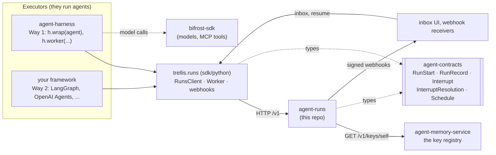

| Repo | Relation to agent-runs |
|---|---|
| [agent-harness](https://github.com/amitmohapatra/agent-harness) | with `RUNS_URL` set, its run store is `trellis.runs.RunsClient`: it records, queues, pauses, resumes and schedules runs here, and `h.worker` is a `trellis.runs.Worker` |
| [agent-contracts](https://github.com/amitmohapatra/agent-contracts) | the records on the wire: the API's bodies are its models (`RunCreate` subclasses `RunStart`), and `RunStatus.can_become` is the one transition check; pinned `>=0.6.1,<0.7` |
| [agent-memory-service](https://github.com/amitmohapatra/agent-memory-service) | the one key registry: every `X-API-Key` is introspected there (`GET /v1/keys/self`) |
| [bifrost-sdk](https://github.com/amitmohapatra/bifrost-sdk) | none: agent-runs makes no model calls |
| **agent-runs** (this repo) | the service, and its SDK `trellis.runs` (`sdk/python`) |

## Components

Two processes from one image share one PostgreSQL database and one blob store. Neither
executes an agent: a harness or any other framework does, through the Python SDK
`trellis.runs` (`sdk/python`, pip `trellis-runs`), and records here what happened. The SDK is
a uv workspace member of this repository: its `RunsClient` speaks every route, its `Worker`
is the claim loop, and its `webhooks.sign` is the one implementation of the delivery
signature, which the ticker signs with and a receiver checks with `verify_signature`.

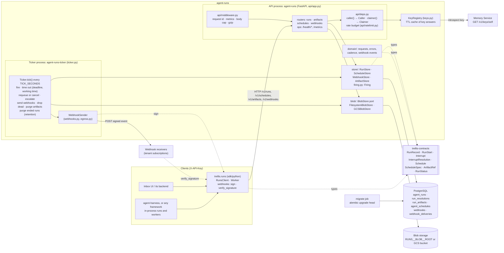

| Component | Where | What it owns |
|---|---|---|
| API | `api/app.py` `create_app`, `api/routers/*` | the HTTP surface |
| OpenAPI | `api/openapi.py` `custom_openapi`, `api/examples.py`, `tools/export_openapi.py` | the document every route shares (metadata, `<tag>.<function>` ids, the `ApiKeyAuth` scheme, a problem on every error status, standard headers); `docs/openapi.json` is it committed, and `tests/test_openapi.py` fails when they differ |
| Errors | `api/errors.py` `install_error_handlers`, `Problem`; `domain/errors.py` `ErrorCode` | every failure as an RFC 9457 problem: `ServiceError` subclasses with their status and `code`, FastAPI's validation and HTTP errors, a database that went away (`503`, `Retry-After`), anything else (`500`, no internals) |
| Middleware | `api/middleware.py` `RequestContextMiddleware`, `BodyLimitMiddleware`, `CompressionMiddleware` | `X-Request-ID` in, out and in every problem; request metrics by route template; the JSON body cap counted as bytes arrive; gzip, except artifact bytes |
| Rate limit | `api/ratelimit.py` `TenantRateLimiter`, `api/deps.py` `_within_budget` | one budget per tenant in PostgreSQL (`rate_limit_buckets`, a GCRA bucket moved by one upsert under the database's clock, on its own connection), shared by every worker of every replica; `429` with `Retry-After`, `X-RateLimit-*` on every counted response |
| Metrics | `observability/metrics.py` | one Prometheus registry per process: the API's `/metrics`, the ticker's `RUNS__TICKER__METRICS_PORT` |
| Caller resolution | `api/deps.py` `caller`, `Caller`; `claimer`, `Claimer` | `X-API-Key` (and `X-Trellis-Tenant` for a platform key) → the tenant and principal of the request; `require_tenant`, `require_may_act_for`. A claim (`claimer`) also takes a platform key with no tenant: it claims from every tenant's queue |
| Claim order | `store/runs.py` `RunStore.claim`, `_next_queued`, `_tenant_has_room`, `_key_has_room` | the next queued run: the tenant whose workers hold fewest runs of the claimed agents first (fair share), then `priority`, then `queued_at`, among runs with room under their `concurrency_key` (`RUNS__RUNS__CONCURRENCY_PER_KEY`) and their tenant's cap (`RUNS__RUNS__MAX_RUNNING_PER_TENANT`); the room recounted under `pg_try_advisory_xact_lock` on the key or tenant, a key another claim is counting passed over like a locked row |
| Run events | `store/runs.py` `RunStore.append_events`, `events`; `api/routers/runs.py` `stream_events`, `_follow` | each run's event log (`run_events`): appends fenced like a heartbeat, a position per event under the run's row lock, repeats (`attempt`, `sequence`) dropped; reads by position, and a server-sent event stream that polls in short transactions of its own (`EVENT_POLL_SECONDS`), keeps quiet connections open (`EVENT_KEEPALIVE_SECONDS`), ends with `end` once the run has, and lasts at most `EVENT_STREAM_SECONDS` |
| Key registry | `keys.py` `KeyRegistry`, `KeyInfo` | introspection at the Memory Service, cached 60 s (refusals 10 s), at most 10 000 keys |
| Answering | `answering.py` `require_may_answer`, `require_may_cancel` | who may answer a paused run: an admin or platform key, or one that may act for anyone, answers any run; a key restricted to listed people answers, only as one of them, a run assigned to that person or to nobody. `RunStore.resume` applies it under the row lock, to the assignee now, before writing; then `trellis.runs.answers.answer_problem` checks the answer fits the question. `RunStore.cancel` applies the same rule (as any principal the key may act for) |
| Stores | `store/runs.py`, `store/schedules.py`, `store/webhooks.py`, `store/artifacts.py` | every read and write of one table family; the caller commits |
| Firing | `firing.py` `Firing` | queueing one run for one schedule tick, in the transaction that advances the schedule |
| Ticker | `ticker.py` `Ticker` | the background loop; a `retry.Breaker` stops it hammering a dead database; `heartbeat.py` is its liveness file and probe |
| Retries | `retry.py` `backoff`, `jittered`, `Breaker` | the one retry policy: a capped doubling backoff (webhook deliveries, schedule fires, a lapsed lease's and a retryable error's requeue, the last two jittered) and the breaker |
| Webhook sender | `webhooks.py` `WebhookSender`; `domain/webhooks.py` `Attempt` | one attempt per due outbox row, signed with the SDK's `trellis.runs.webhooks.sign` (with the replaced secret too during a rotation's overlap); how it went (`Attempt`: accepted, worth another, or refused for good) decides whether `WebhookStore.settle` deletes the row, backs it off or keeps it dead |
| Egress guard | `egress.py` `public_addresses`, `pinned`, `require_public` | the SSRF guard: a subscription's host must resolve to public addresses only, checked on create (`422`) and by the sender on every attempt (a refusal is final), unless `Settings.private_webhook_targets`; the sender then connects only to the addresses it checked (`pinned`: the IP in the URL, the host in `Host` and TLS SNI, so the certificate is checked against it), and never follows a redirect |
| SDK | `sdk/python/src/trellis/runs`: `RunsClient`, `Worker`, `webhooks`, `errors`, `models` | the Python client of every route (method names are the operation ids), the framework-neutral worker loop, the delivery signature; `sdk/python/tests` holds it to 100% line and branch coverage and checks it against `docs/openapi.json` |
| Blob port | `blob/port.py` `BlobStore`, `read`; `blob/filesystem.py`, `blob/gcs.py` | create-only bytes under a key; `put_stream` writes an upload as it arrives (a temporary file, or a bounded spool for GCS), hashing as it goes; `read` verifies SHA-256 and size while streaming |
| Schema | `alembic/versions/*`, `store/tables.py` | migrations are the schema; `tests/test_schema.py` checks the mappings match them; `store/database.py` `connect` refuses a database not at the head revision |
| Engine | `store/database.py` `connect`, `ping`; `config/settings.py` `DatabaseSettings` | one pool per process, its share of the container's connection budget (`pool_plan`), with a pre-ping on checkout, a recycle window, a bounded wait for a connection, a connect timeout and a statement timeout; `ping` is the bounded readiness probe |

## The run lifecycle

The one transition check is `trellis-contracts` `RunStatus.can_become`, called by
`store/runs.py` `_move` under a row lock; a refused transition is `409` and changes nothing.
The arrows are exactly the transitions some route or ticker step makes:
`tests/test_state_machine.py` asserts every route's transition and every refusal, and
`tests/test_queue.py`, `tests/test_deadline.py`, `tests/test_working_time.py`,
`tests/test_retries.py`, `tests/test_cancel.py`, `tests/test_release.py` and
`tests/test_escalation.py` the rest.

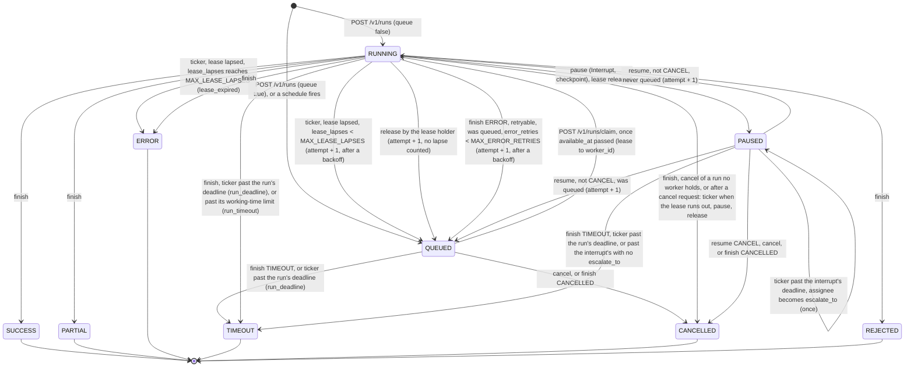

What each move does to the row (`_move`, `_requeue`, `RunStore.resume`):

- Entering `RUNNING` sets `running_since`; leaving it adds the stretch to `worked_seconds`
  and clears `running_since`, the lease (`lease_owner`, `lease_expires_at`) and
  `cancel_requested_at`. A read adds the stretch going on (`RunRecord.worked_seconds`), and
  `time_out_overworked` ends a run whose working time passed its limit (`timeout_seconds`
  or `RUNS__RUNS__MAX_RUN_SECONDS`, the lesser) `TIMEOUT` (`run_timeout`); `_lease` tells
  the worker the time left (`remaining_seconds`).
- Leaving `PAUSED` clears `awaiting`, `assignee`, `awaiting_deadline`; leaving `QUEUED`
  clears `available_at`; any ending clears `checkpoint` and starts the run's artifacts'
  retention (`expires_at = now + ARTIFACT_RETENTION`, 7 days).
- A requeue (`_requeue`) may hold the run back: `available_at = now + wait`, which the claim
  respects. A lapsed lease waits `LAPSE_RETRY_BASE` (5 s) doubling per lapse up to
  `LAPSE_RETRY_CAP` (1 min); a retried error `ERROR_RETRY_BASE` (10 s) doubling up to
  `ERROR_RETRY_CAP` (10 min); both jittered (`retry.jittered`). A release and a resume wait
  for nothing.
- `finish` with `ERROR` and a retryable error, of a run that was queued, running and not
  asked to cancel, requeues it instead of ending it (`_retried`), `error_retries + 1`, at
  most `MAX_ERROR_RETRIES` (3); the error that finally stands says how often the run was
  retried (`_counted`).
- `cancel` ends a queued, paused or unleased running run `CANCELLED` at once; a leased one
  gets `cancel_requested_at`, from which every lease is measured (`_lease`), so the run is
  cancelled within one lease: the worker finishes it, or a pause, a release or the lapse
  sweep ends it `CANCELLED` instead of pausing or requeueing it (`_cancelled_instead`).
  `cancel_reason` and `cancelled_by` keep why and who.
- "Was queued" means `queued_at` is set: the run entered the queue at least once (a
  `queue: true` start or a schedule fire), so a worker, not the original process, resumes it.
- `attempt` counts executions: `+1` on a resume that continues the run and on every requeue
  (a lapsed lease, a release, a retried error), never on a claim. `lease_lapses` counts only the lapses (`+1` on each,
  in `requeue_lapsed`), and only it decides when the ticker gives up on a run: review
  rounds are attempts, not crashes.
- Events go to the outbox in the same transaction: `run.paused` on a pause, `run.escalated`
  on an escalation, `run.finished` on any ending (`domain/webhooks.py` `event_of`). A resume
  that continues the run, and a requeue, announce nothing.
- `MAX_LEASE_LAPSES` is 5 (`config/constants.py`): the 5th lapse ends the run `ERROR`.
- A claim takes a run only with room (`RunStore.claim`): fewer `RUNNING` runs of its
  tenant share its `concurrency_key` than `RUNS__RUNS__CONCURRENCY_PER_KEY`, and fewer runs
  of its tenant are leased than `RUNS__RUNS__MAX_RUNNING_PER_TENANT`. A run kept in its
  caller's process takes its key's place while it runs, but is never held back.
- With `RUNS__RUNS__RETENTION_DAYS` set, the ticker deletes runs that ended before it
  (`RunStore.purge_ended`, `ix_runs_ended`) with their `run_resolutions` and `run_events`; a
  run whose artifacts are still kept waits for them.
- `checkpoint` is written by a pause and, as progress, by the lease holder's heartbeat or
  release; a requeue keeps it, so the next attempt's claim resumes from it; only an ending
  clears it.
- A pause, finish or release records who made it (`settled_by`, the `worker_id` or null),
  as does a finish that requeued the run for a retry; any other move clears it. A repeat of that call (the same caller, to the same status, on the same
  interrupt for a pause) is answered with the stored run and moves nothing (`_settled`),
  so a worker that lost the answer may retry. Otherwise a fenced write (`worker_id`) on a
  run whose lease the worker no longer holds is `LeaseLost` (`409 LEASE_LOST`, `_fence`),
  checked before the transition.
- A resume to a run no longer waiting on its interrupt is a repeat when the resolution kept
  for that interrupt (`run_resolutions`, read under the row lock) is the very same
  (`_answered_by`; `resolved_at` is set once per answer): the run is answered as it is and
  nothing moves. Any other is `409`. An answer that does not fit the question
  (`trellis.runs.answers.answer_problem`) is `422`, and a pause whose `expects` is not a
  JSON Schema (`schema_problem`) too, both before anything is written.

## Start, interrupt, resume

A durable run: queued, claimed by a worker, paused for a person with a large payload in an
artifact, answered from an inbox, claimed again and finished. Every request is
authenticated first (the key is introspected at the Memory Service, or taken from the
cache); that step is drawn once.

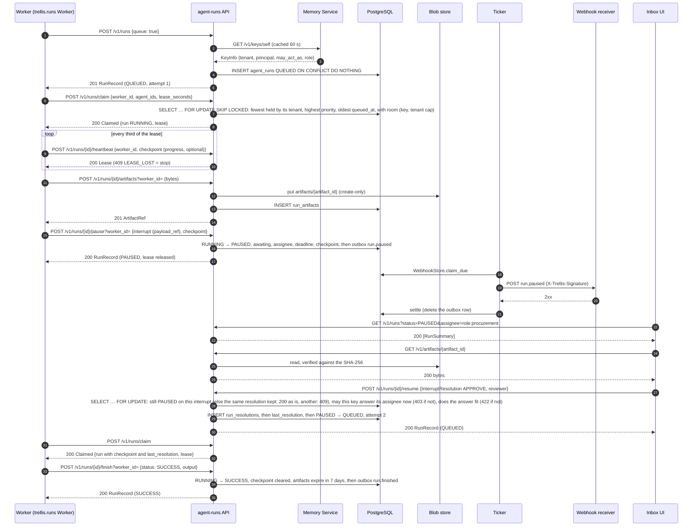

An in-process run is the same without the queue: `POST /v1/runs` records it `RUNNING`, the
pause takes no `worker_id`, and a resume that continues it moves it to `RUNNING` for the
process that resumes it.

## Claim, lease and heartbeat

A worker leases one queued run at a time and keeps the lease alive; every write it makes
names its `worker_id` and is fenced to the lease holder. A worker that stops heartbeating
loses the run to the queue, with its checkpoint, after a backoff.

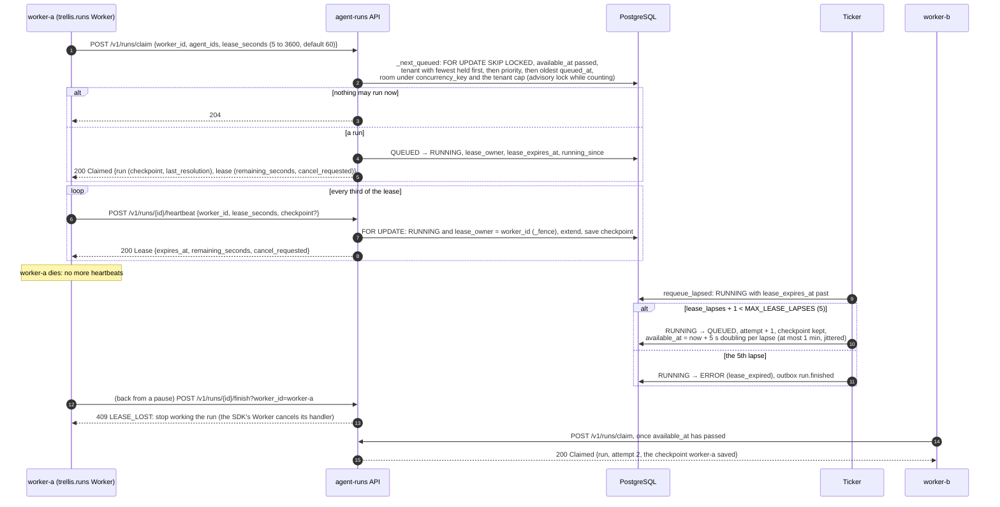

The same fence ends a run whose time is up. Past the run's own `deadline` the ticker ends it
`TIMEOUT` (`run_deadline`); past its working-time limit, `TIMEOUT` (`run_timeout`). The worker
learns from its next heartbeat or write (`409 LEASE_LOST`), and every lease says the working
time left (`remaining_seconds`) so a worker can stop in time.
[examples/02_queue_claim_heartbeat.py](../examples/02_queue_claim_heartbeat.py) runs this flow.

## Pause and resume, and the answer check

A run pauses on one `Interrupt`; a person answers it from an inbox. The answer is checked
under the run's row lock, in this order, before anything is written. A question that
nobody answers in time is escalated once, or times out.

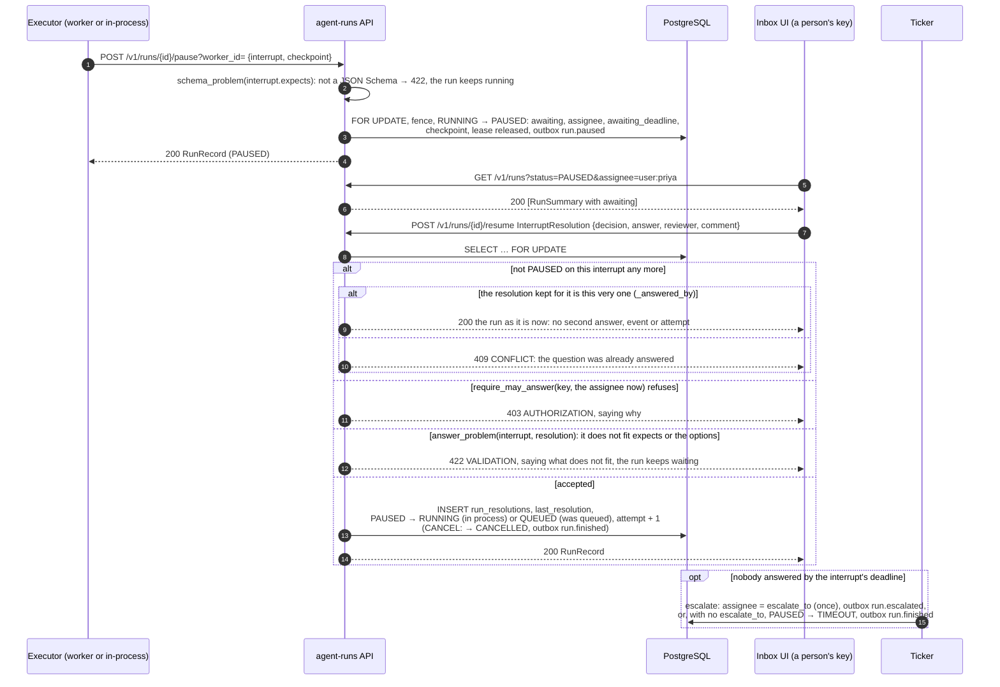

Who may answer is the rule in [the README](../README.md#who-may-answer-a-paused-run) and
[api.md](api.md#who-may-answer-a-paused-run); the answer check is `trellis.runs.answers`, the
same one the harness makes for a run it keeps in its own process.
[examples/03_pause_resume_answer_check.py](../examples/03_pause_resume_answer_check.py) runs
every branch.

## Cancel and release

A cancel ends a run that nobody holds at once and asks a worker that holds one to stop. A
release is a worker letting go of a run because it is stopping itself.

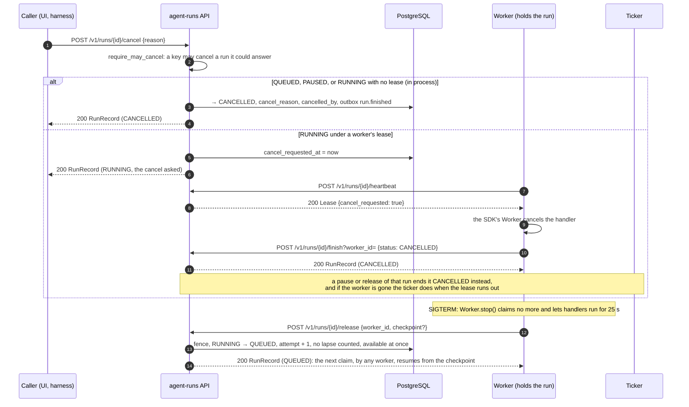

[examples/04_cancel_and_release.py](../examples/04_cancel_and_release.py) runs both.

## A scheduled run firing

A schedule is created once (an upsert on its identity) and the ticker fires it from then
on, as its `on_behalf_of`, while nobody is present. The run it queues is built from the
stored schedule and nothing else, and carries everything a started run can: the schedule's
`timeout_seconds`, `agent_version`, `priority` and `concurrency_key`, and its `metadata`
under the fire's own keys, which win on conflict (`firing.py`; contracts ADR 0007). `POST /v1/schedules/{id}/fire` takes the
same path (`Firing.fire`) for one schedule, on demand.

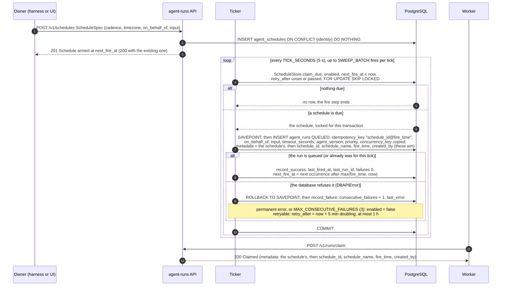

Two tickers on one tick both see the schedule; `SKIP LOCKED` gives it to one, and the
idempotency key would make a repeat find the same run anyway
(`tests/test_ticker.py::test_two_tickers_on_one_tick_queue_one_run`). `next_fire_at` only
moves forward past now, so a long outage fires each schedule once, not once per missed tick.

## Webhook delivery and dead letters

A run change writes its event to an outbox in the same transaction, one row per subscription
of the tenant that wants it, and the ticker delivers it at least once. A delivery the
receiver refuses for good, or one that used its attempts, is kept dead to be redelivered.

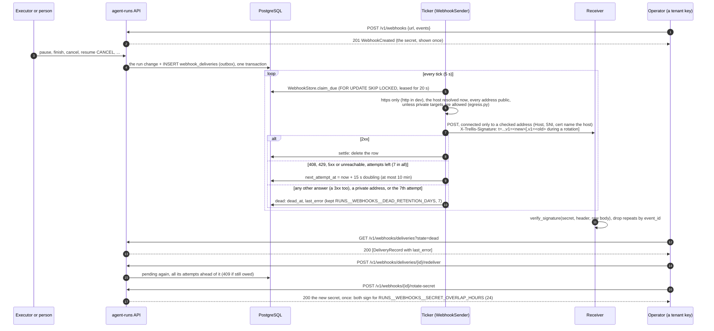

- **Rotating a secret.** `POST /v1/webhooks/{id}/rotate-secret` answers a new secret, once.
  For `RUNS__WEBHOOKS__SECRET_OVERLAP_HOURS` (24) every delivery carries a signature with
  each secret (`t=…,v1=<new>,v1=<old>`, as Stripe does) and `verify_signature` accepts any
  matching one, so receivers switch to the new secret without a missed or refused delivery;
  `previous_secret_expires_at` on the subscription says when the old one stops signing.
- **Dead deliveries.** A delivery that used its 7 attempts (15 s doubling to 10 min apart),
  or that its receiver refused for good (any `4xx` but `408` and `429`), is not deleted: it
  is kept, dead, with its `last_error`, for `RUNS__WEBHOOKS__DEAD_RETENTION_DAYS` (7).
  `GET /v1/webhooks/deliveries?state=dead` (or `&webhook_id=` for one subscription) lists
  them and `POST /v1/webhooks/deliveries/{id}/redeliver` owes one again, at once, with all
  its attempts ahead of it.
- **Where deliveries may go.** Outside `dev` a subscription's URL must be `https` and its host
  must resolve only to public addresses: not private, loopback, link-local (where cloud
  metadata lives), carrier-grade NAT, reserved or multicast (`422` when subscribed). Every
  attempt resolves the host again, once, checks every address, and connects only to an
  address it checked (in the resolver's order, the next when one refuses the connection),
  naming the host in `Host`, in TLS SNI and in the certificate check: a name that changes
  between the check and the connection (DNS rebinding) cannot send a delivery elsewhere. A
  host that now resolves to such an address is refused for good (dead), one that does not
  resolve is retried. Redirects are never followed: a `3xx` is a final answer. A deployment
  whose receivers are inside its own network sets `RUNS__WEBHOOKS__ALLOW_PRIVATE_TARGETS=true`;
  `dev` allows them unless it is `false`.

The payload, headers and events are in [api.md](api.md#events-and-delivery);
[examples/07_webhooks_and_dead_letters.py](../examples/07_webhooks_and_dead_letters.py) runs
a delivery, a dead letter, a redelivery and a rotation.

## Run events and the SSE stream

The executor appends a run's `RunEvent`s while it runs; any replica serves them, by position
or as server-sent events, so a UI that reconnects to another replica misses nothing.

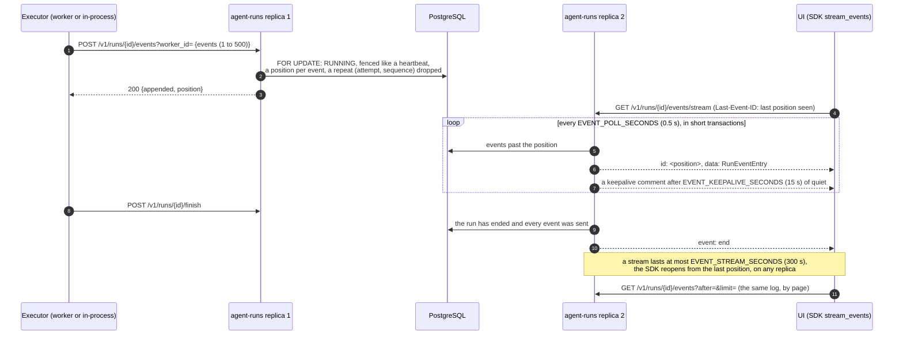

[examples/08_events_and_sse.py](../examples/08_events_and_sse.py) appends, pages and follows
a run's events.

## The ticker

`agent-runs-ticker` is one loop (every `TICK_SECONDS`), straight against the database:

1. **Schedules.** Each due schedule is claimed with `FOR UPDATE SKIP LOCKED` and fired: its
   run is inserted `QUEUED` in the same transaction, idempotent on `(schedule_id,
   fire_time)`. A run that cannot be queued is recorded on the schedule, which backs off
   (retryable) or pauses itself (permanent, or `MAX_CONSECUTIVE_FAILURES`).
2. **Run deadlines.** A run not yet ended (`QUEUED`, `RUNNING` or `PAUSED`) past its own
   `deadline` (`RunStart.deadline`) ends in `TIMEOUT` with an `AgentError` of code
   `run_deadline` (`retryable: false`: a retry would only be later). The deadline is when
   the run must be done by, so time in the queue and time waiting for a person count. A
   worker still running it loses the run: its next heartbeat or write is `409 LEASE_LOST`,
   and the SDK's `Worker` cancels its handler.
3. **Working time.** A `RUNNING` run whose working time passed its limit ends in `TIMEOUT`
   with code `run_timeout` (not retryable). The working time is the time the run spent
   `RUNNING`, across attempts: kept on the run (`worked_seconds`) as each stretch ends, so a
   crash does not reset it, and time queued or waiting for a person does not count. The
   limit is the caller's `RunStart.timeout_seconds` or the operator's
   `RUNS__RUNS__MAX_RUN_SECONDS`, the lesser; neither set, there is none. Every lease (claim,
   heartbeat) says the time left (`remaining_seconds`), so a worker can stop in time; one
   that does not is fenced off as for a deadline.
4. **Leases.** A `RUNNING` run whose lease lapsed (its worker stopped heartbeating) goes
   back to `QUEUED` as the next attempt, after a short backoff (5 s, doubling per lapse, at
   most 1 min, jittered: a run that kills its worker is not handed straight to the next), or
   ends in `ERROR` (`lease_expired`) on its `MAX_LEASE_LAPSES`-th (5th) lapse. Only lapses
   count toward that, never a person's answers: a run reviewed ten times still survives four
   crashes. A run whose cancel was asked for ends `CANCELLED` instead.
5. **Escalation.** A `PAUSED` run past its interrupt's `deadline` moves to `escalate_to`
   (once) or ends in `TIMEOUT`, with a webhook event either way.
6. **Webhooks.** Due deliveries in the outbox are sent (one attempt each, concurrently),
   then removed, rescheduled with backoff, or, given up on, kept as dead (below).
7. **Dead deliveries.** Deliveries dead for more than `RUNS__WEBHOOKS__DEAD_RETENTION_DAYS`
   (7) are dropped.
8. **Artifacts.** Artifacts of runs that ended more than `ARTIFACT_RETENTION` (7 days) ago
   are deleted: the blob, then the record.
9. **Run retention.** Only when the operator sets `RUNS__RUNS__RETENTION_DAYS`: runs that
   ended longer ago are deleted with their resolutions and events, a run with artifacts
   still kept after them. Unset, every run is kept.

Each step is bounded per tick and safe in several replicas. A tick that fails as a whole
(the database is down) counts against a breaker; `python -m agent_runs.heartbeat` is the liveness
check (a heartbeat file touched after every tick, `RUNS__TICKER__HEARTBEAT_FILE`, one per
ticker; unset, each ticker process beats into its own file in the temp directory).

## The tables

Eight tables, built by the nineteen Alembic revisions in `alembic/versions` (head
`9d5e0f1a2b3c`) and mapped in `store/tables.py`. Solid lines are foreign keys; the dotted
line is the logical link a schedule fire leaves (no foreign key: a run outlives the schedule
that fired it).

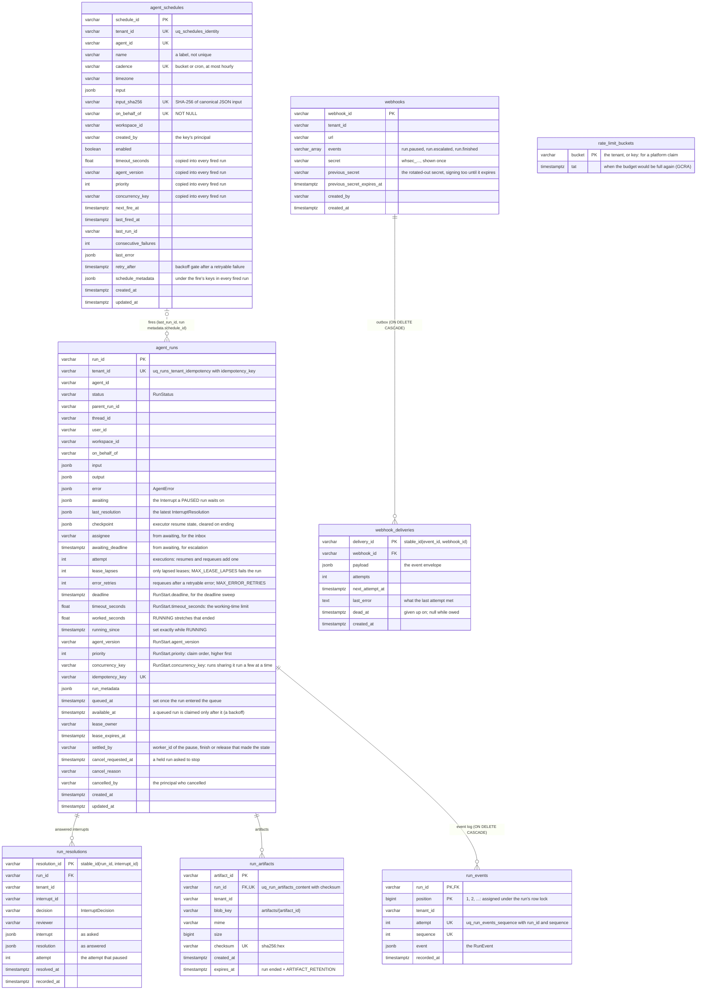

Every listing is a keyset page (`store/paging.py`): ordered by `created_at` (or
`recorded_at`) and the id, fetched one row past the page, the next page starting strictly
after the last row returned. The indexes each serve one query:

| Index | Table | Serves |
|---|---|---|
| `ix_runs_tenant_created` | `agent_runs (tenant_id, created_at)` | `GET /v1/runs`, newest first |
| `ix_runs_parent` | `agent_runs (parent_run_id)` | `GET /v1/runs?parent_run_id=` |
| `ix_runs_inbox` | `agent_runs (tenant_id, status, assignee, created_at)` | the inbox, `status=PAUSED&assignee=` |
| `ix_runs_queue` | `agent_runs (tenant_id, agent_id, queued_at) WHERE status = 'QUEUED'` | `RunStore.claim` |
| `ix_runs_lease` | `agent_runs (status, lease_expires_at) WHERE lease_expires_at IS NOT NULL` | `RunStore.requeue_lapsed` |
| `ix_runs_escalation` | `agent_runs (awaiting_deadline) WHERE status = 'PAUSED' AND awaiting_deadline IS NOT NULL` | `RunStore.escalate_overdue` |
| `ix_runs_deadline` | `agent_runs (deadline) WHERE status IN ('QUEUED', 'RUNNING', 'PAUSED') AND deadline IS NOT NULL` | `RunStore.time_out_past_deadline` |
| `ix_runs_working` | `agent_runs (running_since) WHERE status = 'RUNNING'` | `RunStore.time_out_overworked` |
| `ix_runs_concurrency` | `agent_runs (tenant_id, concurrency_key) WHERE status = 'RUNNING' AND concurrency_key IS NOT NULL` | `RunStore.claim`: the runs sharing a key |
| `ix_runs_leased` | `agent_runs (tenant_id, agent_id) WHERE status = 'RUNNING' AND lease_owner IS NOT NULL` | `RunStore.claim`: what each tenant's workers hold (fair share, the cap) |
| `ix_runs_ended` | `agent_runs (updated_at) WHERE status IN (the endings)` | `RunStore.purge_ended` |
| `run_events` primary key | `run_events (run_id, position)` | `RunStore.events`, the stream |
| `ix_run_resolutions_run` | `run_resolutions (tenant_id, run_id, recorded_at)` | `GET /v1/runs/{id}/resolutions` |
| `ix_run_artifacts_expiry` | `run_artifacts (expires_at) WHERE expires_at IS NOT NULL` | `ArtifactStore.expired` |
| `ix_schedules_tenant_created` | `agent_schedules (tenant_id, created_at)` | `GET /v1/schedules`, newest first |
| `ix_schedules_due` | `agent_schedules (next_fire_at) WHERE enabled` | `ScheduleStore.claim_due` |
| `ix_webhooks_tenant` | `webhooks (tenant_id)` | listing, `WebhookStore.announce` |
| `ix_webhook_deliveries_due` | `webhook_deliveries (next_attempt_at) WHERE dead_at IS NULL` | `WebhookStore.claim_due` |
| `ix_webhook_deliveries_webhook` | `webhook_deliveries (webhook_id)` | the cascade on unsubscribe, `GET /v1/webhooks/deliveries?webhook_id=` |
| `ix_webhook_deliveries_dead` | `webhook_deliveries (dead_at) WHERE dead_at IS NOT NULL` | `WebhookStore.drop_dead` |

The migrations, oldest first: `1f6242bb21de` initial runs table, `7c1d2e3f4a5b` queue, lease
and inbox, `8d2e3f4a5b6c` schedules, `9e3f4a5b6c7d` run checkpoint, `a0f4b5c6d7e8` schedule
identity, `b1a5c6d7e8f9` webhook subscriptions, `c2b6d7e8f9a0` run artifacts,
`d3c8e9f0a1b2` run resolutions, `e4d9f0a1b2c3` run `settled_by`, `f5e0a1b2c3d4` lease lapses
and the run deadline sweep, `1a7f2b3c4d5e` run working time, `2b8a3c4d5e6f` run retries,
`3c9b4d5e6f7a` run cancel, `4d0c5e6f7a8b` webhook dead letters and secret rotation,
`5e1f6a7b8c9d` schedules' run limits, `6a2b7c8d9e0f` run priority and concurrency key,
`7b3c8d9e0f1a` shared rate-limit budgets, `8c4d9e0f1a2b` run events, `9d5e0f1a2b3c` run
retention, `0a6b1c2d3e4f` schedules' run priority and concurrency key. Each has a downgrade; CI runs upgrade, downgrade to base and upgrade again.

## Code map

```
src/agent_runs/
  __main__.py          agent-runs: uvicorn on RUNS__SERVICE__HOST:PORT, RUNS__SERVICE__WORKERS
                       processes (one per CPU, 1 to 8), graceful shutdown
  ticker.py            agent-runs-ticker: Ticker, run(), main()
  heartbeat.py         the ticker's liveness file; python -m agent_runs.heartbeat is the probe
  keys.py              KeyRegistry, KeyInfo: who an X-API-Key is
  firing.py            Firing: one schedule tick → one queued run
  webhooks.py          WebhookSender: delivering the outbox (signed with trellis.runs.webhooks.sign)
  egress.py            public_addresses(), pinned(), require_public(): where a webhook may go
  answering.py         require_may_answer(), require_may_cancel(): who may answer or cancel a run
  retry.py             backoff(), jittered(), Breaker: the one retry policy
  api/app.py           create_app(): routers, middleware, error handlers, health routes
  api/errors.py        Problem, install_error_handlers(): every error as a problem
  api/middleware.py    request context (id, metrics), body cap, compression
  api/pagination.py    cursor in, Link: rel="next" out
  api/openapi.py       the OpenAPI document: metadata, ids, problems, headers
  api/examples.py      a request example for every body
  api/ratelimit.py     TenantRateLimiter: one budget per tenant, in PostgreSQL
  api/routers/ops.py   /health/live, /health/ready, /metrics
  api/deps.py          Caller, caller(), Claimer, claimer(), session(): who is calling (a
                       claim may span tenants), a session per request
  api/routers/         runs.py, artifacts.py, schedules.py, webhooks.py
  domain/              runs.py, schedules.py, webhooks.py (request and answer models),
                       cadence.py (validate_cadence, next_fire_at), errors.py (status, ErrorCode)
  store/               tables.py (the mappings), runs.py, schedules.py, webhooks.py,
                       artifacts.py, database.py (connect + the head-revision check),
                       paging.py (Page, page_of: keyset pages)
  blob/                port.py (BlobStore, read), filesystem.py, gcs.py, open_blob_store()
  config/              settings.py (RUNS__* deployment facts), constants.py (design decisions)
  tools/               export_openapi.py: docs/openapi.json (make openapi)
  observability/       logging.py (structlog, JSON or console), metrics.py (Prometheus)

sdk/python/src/trellis/runs/      (trellis-runs, a workspace member; no trellis/__init__.py)
  client.py            RunsClient: the run verbs (cancel and release among them), list/iterate,
                       append_events/events/stream_events, live/ready/metrics
  artifacts.py         ArtifactsAPI: upload (with its SHA-256), download
  schedules.py         SchedulesAPI: create, list, get, update, delete, fire
  webhooks.py          WebhooksAPI (rotate_secret, deliveries, redeliver too); sign,
                       verify_signature, parse_delivery, the header names
  worker.py            Worker, Job, WorkerStore, RELEASED, OUT_OF_TIME: the claim loop (a
                       handler is stopped at the run's working time)
  models.py            RunSummary, Lease, Claimed, ResolutionEntry, RunEventEntry, EventsAppended,
                       ScheduleUpdate, FireResult,
                       Webhook*, DeliveryRecord, DeliveryState, WebhookDelivery, Page
  errors.py            RunsError and its classes, error_from_problem
  _transport.py        the key and tenant headers, retries, Retry-After, Link paging, the
                       server-sent event reader
```
